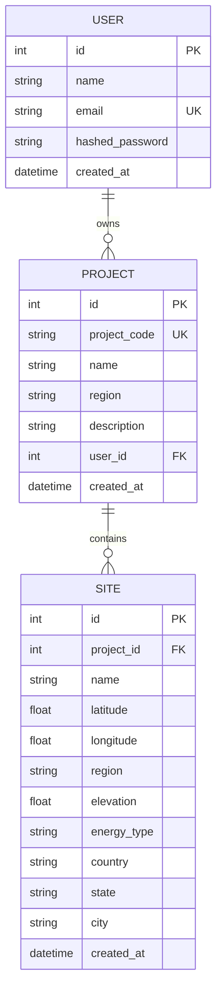

# ⚡ Swind — AI & GIS Renewable Energy Site Selection Platform

**Swind** is an intelligent, GIS-powered spatial intelligence platform designed for renewable energy site selection and feasibility assessment. It empowers energy developers, engineers, and urban planners to evaluate candidate sites for **Solar PV Arrays** and **Wind Turbine Farms** using interactive maps, real-time elevation APIs, reverse geocoding, automated terrain suitability filtering, and downloadable PDF site assessment reports.

---

## 🌟 Key Features

### 🌍 1. Interactive GIS Mapping & Location Intelligence
- **Interactive Map Picker**: Powered by Leaflet & OpenStreetMap for pinpoint placement of candidate renewable energy sites.
- **Auto-Reverse Geocoding**: Integrated with the OpenStreetMap Nominatim API to auto-fill **Country, State/Region, and City/District** upon dropping or dragging a map pin.
- **Cascading Location Selectors**: 2-way synchronized location selection using the `country-state-city` engine.

### ⛰️ 2. Real-Time Terrain & Elevation Integration
- **Elevation API Integration**: Automatically queries the **Open-Meteo Elevation API** on pin placement to retrieve accurate ground elevation in meters.
- **Dynamic Terrain Validation**: Evaluates site viability based on topographical constraints.

### 🚫 3. Ocean & Extreme Terrain Exclusion Filtering
- **Water Body & Ocean Detection**: Flags pins dropped in international waters, oceans, seas, or bays.
- **Extreme Mountain Exclusion**: Identifies unviable high-altitude mountain peak locations ($> 3,000\text{ meters}$).
- **Automated Suitability Warning**: Displays an immediate warning alert and disables site registration for non-viable locations:
  > ⚠️ *"No Solar/Wind Energy Can Be Implemented As There Is Zero Suitability And It Is Not Economic"*

### 📁 4. Project Folders & Site Portfolio Management
- **Project Folder Organization**: Organize candidate sites into dedicated project folders.
- **View All Projects Grid**: A responsive grid view inspired by modern card interfaces (Gemini Notebook style) to inspect all projects and their sites.
- **Management Capabilities**: Complete **Rename** and **Delete** actions for both Project Folders and individual candidate sites with modal overlays and confirmation alerts.

### 🤖 5. AI Feasibility & Environmental Assessment
- Run automated AI feasibility assessments on registered candidate sites to evaluate solar irradiance, wind speed potential, grid proximity, and environmental metrics.

### 🌓 6. Premium Theme Design System
- Built-in **Dark Mode & Light Mode** toggle matching modern dark slate and crisp light palettes across all components.

### 📄 7. PDF Site Analysis Report Generation & Export
- **Automated PDF Generator**: Integrated with `jsPDF` for instant 1-click export of high-definition site assessment reports.
- **Structured 4-Section Report Layout**:
  - **Section 1: Project Details** — Project Name, Code (`PRJ-XXXXXX`), and Region.
  - **Section 2: Candidate Site Details** — Site Name, Renewable Energy Type (Solar/Wind), Location, Coordinates, and Elevation.
  - **Section 3: Analysis Report & Predictive Analytics** — Land Suitability Score (%), Solar & Wind MWh/year, Capacity Factors, Open-Meteo GHI & Wind Speed data, and CO₂ Offsets.
  - **Section 4: Suitability & Executive Site Assessment Message** — Color-coded status badge and detailed economic feasibility statement.

---

## 🏗️ Technology Stack

| Layer | Technologies Used |
| :--- | :--- |
| **Frontend** | React 18, Vite, React Router DOM, React Leaflet, Leaflet CSS, Country-State-City, jsPDF, html2canvas |
| **Backend** | Python 3.10+, FastAPI, SQLAlchemy ORM, Pydantic, Uvicorn |
| **Database** | PostgreSQL |
| **Authentication** | OAuth2 with Password Hashing (Bcrypt) & JWT Tokens |
| **External APIs** | OpenStreetMap Nominatim (Reverse Geocoding), Open-Meteo (Elevation API) |

---

## 📐 Database Schema & Architecture



---

## 🔌 API Reference

### 🔐 Authentication (`/api/auth`)
- `POST /api/auth/signup` — Register a new user account.
- `POST /api/auth/login` — Authenticate and receive a JWT Bearer token.
- `GET  /api/auth/profile` — Fetch current authenticated user details and project statistics.

### 📁 Projects (`/api/projects`)
- `POST   /api/projects` — Create a new project (auto-generates unique `PRJ-XXXXXX` code).
- `GET    /api/projects` — List all projects and registered candidate sites for current user.
- `GET    /api/projects/{id}` — Get project details and associated sites.
- `PATCH  /api/projects/{id}` — Rename a project folder.
- `DELETE /api/projects/{id}` — Delete a project and all its associated sites.

### 📍 Sites (`/api/projects/{id}/sites`)
- `POST   /api/projects/{id}/sites` — Register a new candidate site (Solar / Wind).
- `PATCH  /api/projects/{id}/sites/{site_id}` — Rename a registered site.
- `DELETE /api/projects/{id}/sites/{site_id}` — Delete a registered site.
- `POST   /api/projects/{id}/sites/{site_id}/assess` — Trigger AI Feasibility Assessment.

---

## ⚙️ Local Setup & Installation

### 1. Prerequisites
- **Node.js** (v18+)
- **Python** (v3.10+)
- **PostgreSQL** database instance running locally or hosted

### 2. Backend Setup
```bash
# Navigate to backend directory
cd backend

# Create virtual environment
python -m venv venv
source venv/bin/activate  # On Windows: venv\Scripts\activate

# Install dependencies
pip install -r requirements.txt

# Run database migrations
python app/migrate_db.py

# Start FastAPI development server
uvicorn app.main:app --reload --port 8000
```

### 3. Frontend Setup
```bash
# Navigate to frontend directory
cd frontend

# Install dependencies
npm install

# Start Vite development server
npm run dev
```

The application will be accessible at `http://localhost:5173`.

---

## 🚩 Project Milestones

- ✅ **Milestone 1**: User Authentication, JWT Token system, Core Navigation & Layouts.
- ✅ **Milestone 2**: Interactive GIS Leaflet map integration, Candidate Site modal forms, FastAPI endpoints.
- ✅ **Milestone 3**: Real-time Geocoding & Elevation API integration, Ocean & Extreme Mountain Terrain exclusion filtering, Projects Dashboard page (`/projects`), Rename/Delete folder workflows, and UI polishing.
- ✅ **Milestone 4**: Automated PDF Site Analysis Report Generation (`jsPDF`), structured 4-section report layouts, project-to-site data binding fixes, and comprehensive project documentation.

---

## 🎯 Conclusion

> **Swind** bridges the gap between raw spatial data and rapid clean-energy deployment. By combining interactive GIS mapping, real-time elevation intelligence, automated terrain suitability filtering, and instant downloadable PDF site reports, Swind eliminates non-viable sites before capital is committed—making renewable site selection faster, smarter, and economically feasible.

---

## 📄 License
This project is open-source and available under the **MIT License**.
